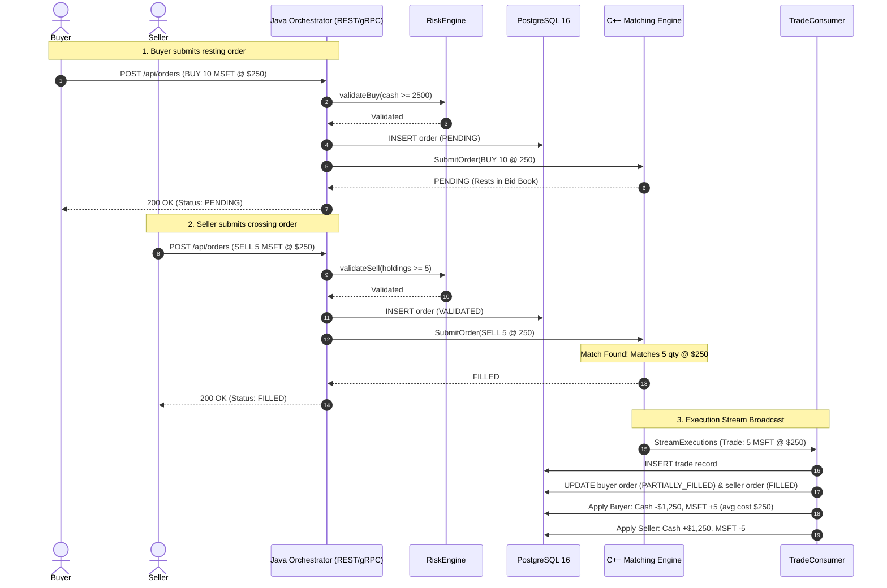

# Polyglot Trading Platform — Architecture & Design

This document details the architectural design, component interactions, data flows, and technical decisions of the **Polyglot Trading Platform**.

---

## 1. System Overview

The platform uses a **polyglot microservices architecture**, assigning each core responsibility to the programming language and runtime best suited for it:

```
                  ┌──────────────────────────────────────────────┐
                  │          External Clients / Browser          │
                  │   (Swagger UI / REST Clients / Frontends)    │
                  └──────────────────────┬───────────────────────┘
                                         │ HTTP 8080 (REST / JSON)
                                         ▼
┌──────────────────────────────────────────────────────────────────────────────────┐
│                             Java Spring Boot Orchestrator                        │
│                                                                                  │
│   ┌───────────────────────────┐                ┌─────────────────────────────┐   │
│   │   TradingRestController   │                │   OrchestratorServiceImpl   │   │
│   │    (HTTP API + Swagger)   │                │         (gRPC 50052)        │   │
│   └─────────────┬─────────────┘                └──────────────┬──────────────┘   │
│                 │                                             │                  │
│                 ▼                                             ▼                  │
│   ┌──────────────────────────────────────────────────────────────────────────┐   │
│   │                        RiskEngine (Pre-Trade Checks)                     │   │
│   │             • Cash Balance Check     • Asset Holding Check               │   │
│   └─────────────────────────────────────┬────────────────────────────────────┘   │
│                                         │                                        │
│                 ┌───────────────────────┴───────────────────────┐                │
│                 │                                               ▼                │
│                 │ (Order Validated)               ┌──────────────────────────┐   │
│                 │                                 │   Order & Trade DB Repo  │   │
│                 ▼                                 └─────────────┬────────────┘   │
│   ┌───────────────────────────┐                                 │                │
│   │  gRPC Client (EngineStub) │                                 │                │
│   └─────────────┬─────────────┘                                 │                │
│                 │                                               │                │
│                 │ (SubmitOrder)                                 │                │
│                 ▼                                               │                │
│   ┌───────────────────────────┐   (Real-time Executions)        │                │
│   │       TradeConsumer       │◄───────────────────────────┐    │                │
│   │  (Background Stream Sub)  │                            │    │                │
│   └─────────────┬─────────────┘                            │    │                │
│                 │                                          │    │                │
│                 ▼                                          │    │                │
│   ┌───────────────────────────┐                            │    │                │
│   │     PortfolioService      │                            │    │                │
│   │  (@Transactional Updates) │                            │    │                │
│   └─────────────┬─────────────┘                            │    │                │
└─────────────────┼──────────────────────────────────────────┼────┼────────────────┘
                  │                                          │    │
                  │ gRPC (TCP 50051)                         │    │ JDBC (Port 5433)
                  ▼                                          │    ▼
┌──────────────────────────────────────┐                     │  ┌──────────────────┐
│         C++ Matching Engine          │                     │  │   PostgreSQL 16  │
│                                      │                     │  │                  │
│  ┌────────────────────────────────┐  │                     │  │  • users         │
│  │       ExecutionService         │  │                     │  │  • portfolios    │
│  │   (gRPC Server: Port 50051)    │  │                     │  │  • positions     │
│  └────────────────┬───────────────┘  │                     │  │  • orders        │
│                   │                  │                     │  │  • trades        │
│                   ▼                  │                     │  └──────────────────┘
│  ┌────────────────────────────────┐  │                     │
│  │     MatchingEngine (Core)      │  │                     │
│  │   • Price-Time Priority (FIFO) │  │                     │
│  │   • OrderBook per symbol       │──┼─────────────────────┘
│  │   • O(1) Cancellations         │  │ (StreamExecutions)
│  └────────────────────────────────┘  │
└──────────────────────────────────────┘
```

---

## 2. Key Architecture Pillars

| Component | Technology | Primary Role | Why This Technology? |
|---|---|---|---|
| **Execution Engine** | C++20, gRPC, CMake | Order matching, limit order books, execution generation | Zero-overhead abstractions, deterministic microsecond latency, cache-friendly data structures, manual memory control. |
| **Orchestrator** | Java 21, Spring Boot 3, Hibernate/JPA | Risk validation, account balance & position accounting, order orchestration, REST/OpenAPI and gRPC endpoints | Strong transactional isolation (`@Transactional`), rich ecosystem, robust enterprise relational data integration. |
| **Persistence** | PostgreSQL 16 | ACID system of record for users, portfolios, positions, orders, and executed trades | Strict data integrity, foreign keys, row-level locking capabilities, precision decimal handling (`NUMERIC(18,8)`). |
| **Contracts** | Protocol Buffers v3 | Canonical type definitions and cross-service RPC contracts | Strict schemas, backward compatibility, language-neutral high performance binary serialization. |
| **Containerization** | Docker, Compose | Reproducible build and runtime environment across platforms | Multi-stage slim production images, isolated internal networking. |

---

## 3. Component Deep Dive

### 3.1. C++ Matching Engine (`engine/`)

The matching engine is a self-contained, high-performance service running in Docker on port `50051`. It has zero database dependencies to guarantee predictable latency.

#### Data Structures (`order_book.hpp`, `order_book.cpp`)
- **Bids**: Stored in `std::map<double, std::list<Order>, std::greater<double>>` (highest price first).
- **Asks**: Stored in `std::map<double, std::list<Order>, std::less<double>>` (lowest price first).
- **FIFO within price levels**: Each price level contains a `std::list<Order>` preserving time priority.
- **Fast Order Index**: `std::unordered_map<std::string, OrderLocation>` tracks the exact iterator of every resting order, enabling **$O(1)$ cancellations**.

#### Matching Algorithm (`matching_engine.cpp`)
1. An incoming order checks the opposite side of the book:
   - Incoming `BUY`: Matches against lowest available `Ask` if `Buy Price >= Ask Price`.
   - Incoming `SELL`: Matches against highest available `Bid` if `Sell Price <= Bid Price`.
2. Matches produce execution trades priced at the **resting order's price** (the maker's price).
3. If the incoming quantity exceeds the top resting level, it sweeps down through subsequent price levels.
4. Any unfilled remainder of a `LIMIT` order is inserted into the book as a resting order (`PENDING`).
5. Each match invokes `TradeBroadcaster`, which generates a UUID `trade_id`, stamps the millisecond timestamp, and broadcasts to all active gRPC streams.

---

### 3.2. Java Orchestrator (`orchestrator/`)

The orchestrator mediates between external clients, internal business rules, the database, and the matching engine.

#### A. Pre-Trade Risk Engine (`RiskEngine.java`)
Runs synchronously before any order reaches the engine:
- **BUY Validation**: Ensures the buyer's cash balance is sufficient:
  $$\text{cash} \ge \text{quantity} \times \text{price}$$
- **SELL Validation**: Ensures the seller currently holds enough shares of the specified asset:
  $$\text{holding} \ge \text{quantity}$$
- If validation fails, the order is rejected immediately in the database (`REJECTED`) and returns **HTTP 422 Unprocessable Entity** with the rejection reason.

#### B. Transactional Portfolio & Accounting (`PortfolioService.java`)
Executes atomically within `@Transactional` boundaries upon trade execution:
- **Buyer Updates (`applyBuy`)**:
  - Cash deducted: $\text{cash}_{\text{new}} = \text{cash}_{\text{old}} - (\text{quantity} \times \text{price})$
  - Position quantity credited: $\text{qty}_{\text{new}} = \text{qty}_{\text{old}} + \text{quantity}$
  - **Weighted Average Cost Basis** recalculated:
    $$\text{avgCost}_{\text{new}} = \frac{(\text{avgCost}_{\text{old}} \times \text{qty}_{\text{old}}) + (\text{price} \times \text{quantity})}{\text{qty}_{\text{new}}}$$
- **Seller Updates (`applySell`)**:
  - Cash credited: $\text{cash}_{\text{new}} = \text{cash}_{\text{old}} + (\text{quantity} \times \text{price})$
  - Position quantity debited: $\text{qty}_{\text{new}} = \text{qty}_{\text{old}} - \text{quantity}$

#### C. Asynchronous Trade Consumer (`TradeConsumer.java`)
- On application boot (`@PostConstruct`), connects to the C++ engine's gRPC execution stream (`StreamExecutions`).
- When a trade is received from the matching engine:
  1. Persists the `Trade` record into PostgreSQL.
  2. Loads buyer and seller orders from DB and updates statuses to `FILLED` (or `PARTIALLY_FILLED`).
  3. Calls `PortfolioService.applyTrade()` to update balances and positions.

#### D. API Surfaces
- **REST Controller (`TradingRestController.java`)**: 
  - `POST /api/orders` — Submit new order.
  - `GET /api/orders?userId=` — Query order history.
  - `DELETE /api/orders/{orderId}` — Cancel order.
  - `GET /api/portfolio/{userId}` — Query portfolio balances and holdings.
  - `GET /api/trades?symbol=` — Query trade executions.
  - Interactive **OpenAPI 3 / Swagger UI** at `/swagger-ui/index.html`.
- **gRPC Server (`OrchestratorServiceImpl.java`)**:
  - Implements `OrchestratorService` on port `50052` (`PlaceOrder`, `GetPortfolio`, `StreamTrades`).

---

## 4. End-to-End Data Flow

### Sequence: Crossing Order Match & Settlement



---

## 5. Port & Network Topology

| Port | Protocol | Component | Purpose |
|---|---|---|---|
| **8080** | HTTP | Java Orchestrator | External REST API, OpenAPI docs, and interactive Swagger UI. |
| **50051** | gRPC (HTTP/2) | C++ Matching Engine | Internal low-latency RPC for order submission, cancellation, and execution streaming. |
| **50052** | gRPC (HTTP/2) | Java Orchestrator | Microservice gRPC endpoint for strategy engines or internal clients. |
| **5433** (host) / **5432** (container) | TCP | PostgreSQL 16 | Relational database storage. |
| **9092** | TCP | Kafka (Optional Infra) | Distributed asynchronous event log for signal and market data pipeline. |

---

## 6. Verification Architecture

The platform includes an automated end-to-end integration test runner:
- **Test Script**: [`scripts/test_platform.ps1`](scripts/test_platform.ps1)
- **Database Fixture**: [`scripts/seed_test.sql`](scripts/seed_test.sql)

It runs 9 consecutive verification stages against live services:
1. **Initial Account & Balance Verification** (REST)
2. **Pre-Trade Risk Engine Rejection on Overdraft** (REST $\to$ HTTP 422)
3. **Pre-Trade Risk Engine Rejection on Short-Selling** (REST $\to$ HTTP 422)
4. **Resting Limit Order Injection** (REST $\to$ C++ Engine `PENDING`)
5. **In-Flight Order Cancellation** (REST $\to$ C++ Engine removal $\to$ DB `CANCELLED`)
6. **Crossing Order Matching** (REST $\to$ C++ Engine immediate match)
7. **gRPC Execution Streaming & Persistence** (Engine $\to$ `TradeConsumer` $\to$ DB `trades`)
8. **Buyer Balance & Weighted Average Cost Recalculation** (PostgreSQL verification)
9. **Seller Balance & Asset Holding Debit** (PostgreSQL verification)
